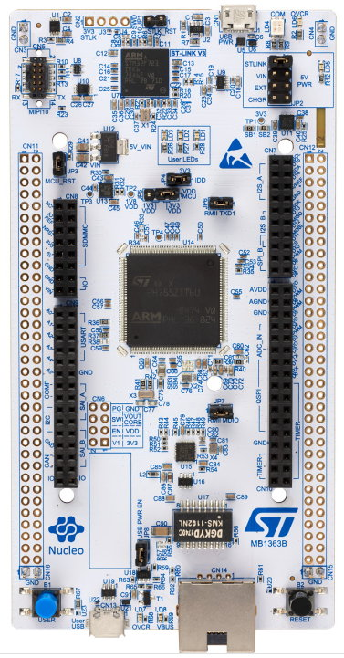
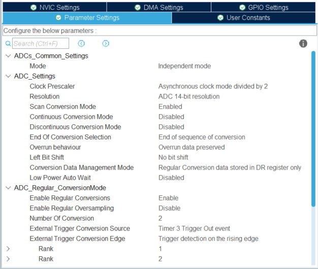

# Overview

2 Adc input at high speed without DMA . Detect the voltage of the sawtooth according to the pick of a wave signal. 

STM32H745ZI-Q - Board Nucleo-H7 Nucleo-144 boards.  

  

  

### Enable ADC1 and ADC2 global interrupt from NVIC Settings  

